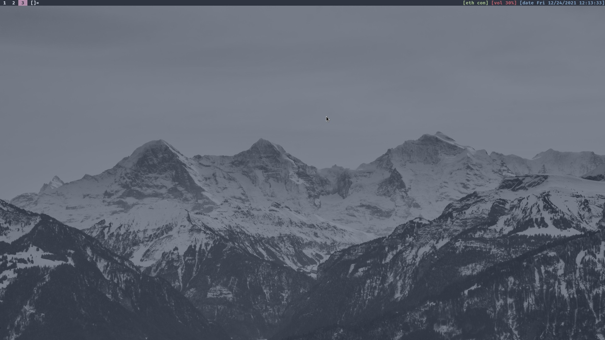
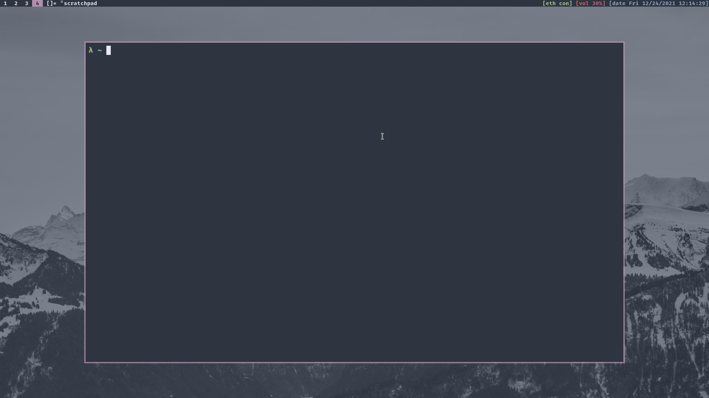
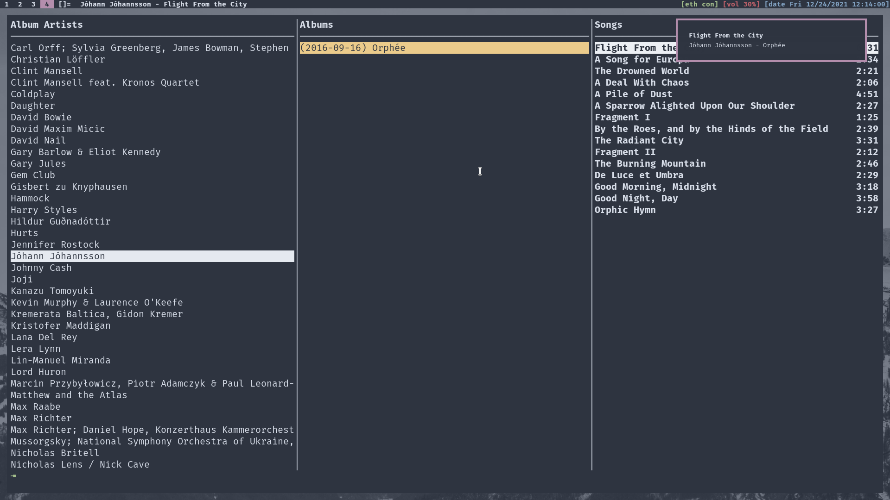
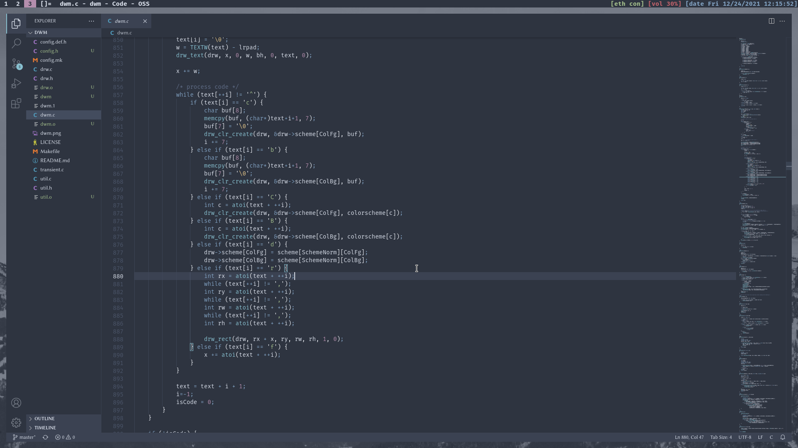

# thehnm's Dotfiles

This dotfile repository contains configuration files for my Arch Linux setup with
[dwm](https://github.com/thehnm/dwm).

Furthermore, my Arch Linux installation script [autoarch](https://github.com/thehnm/tarbs)
also installs my configurations found here.
Just download and run it with:

```bash
curl -LO https://raw.githubusercontent.com/thehnm/tarbs/master/install.sh
bash install.sh
```

## Required Sofware

You can find the software with my own changes, configurations and patches here:

- [dwm](https://github.com/thehnm/dwm)
- [dmenu](https://github.com/thehnm/dmenu)
- [st](https://github.com/thehnm/st)
- [slock](https://github.com/thehnm/slock)






