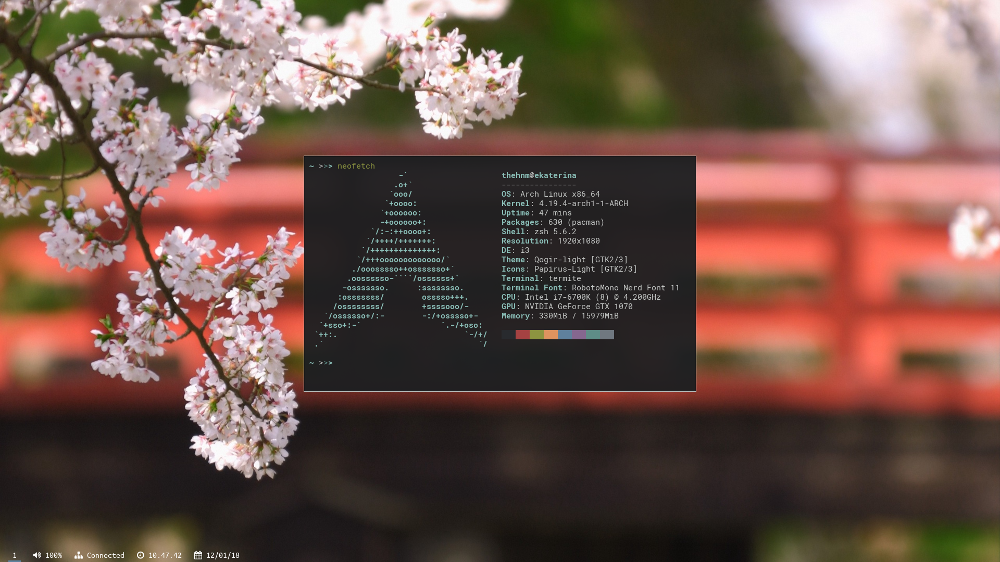
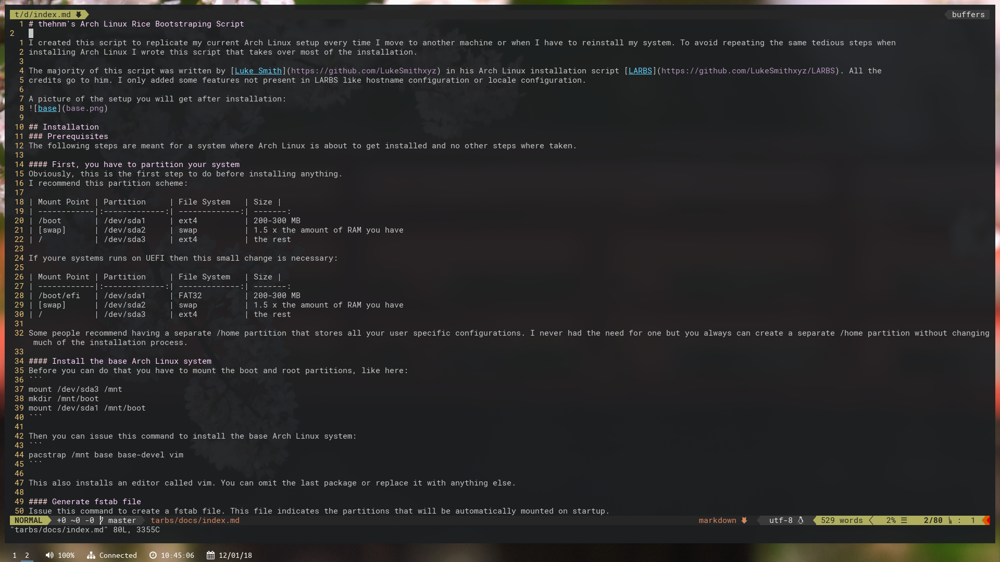
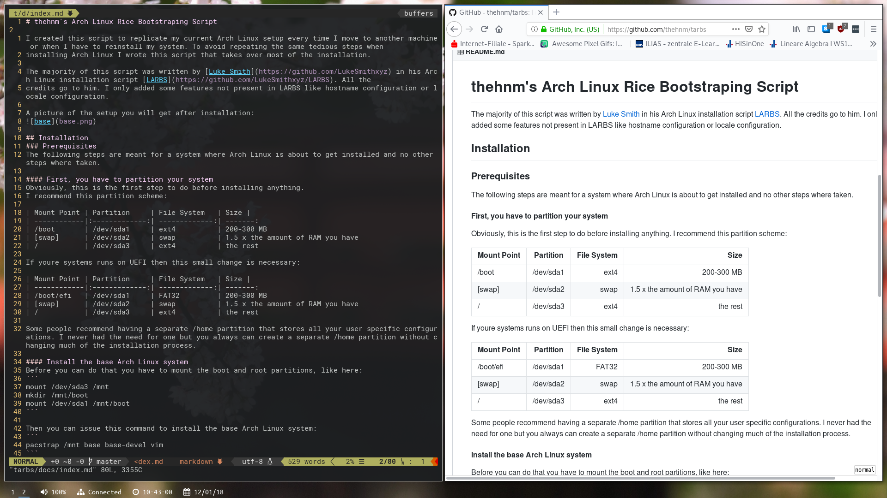

# thehnm's i3 dotfiles

Feel free to copy my setup. But you need this software to work with it:
* `i3-gaps` the actual window manager
* `stow` to symlink the configs
* `compton` for allowing transparency
* `polybar` the bar itself
* `scrot` for taking screenshots
* `dunst` for sending notifications
* `nitrogen` to set the wallpapers
* `lxappearance` to set the gtk theme

Some pictures of my current setup:

